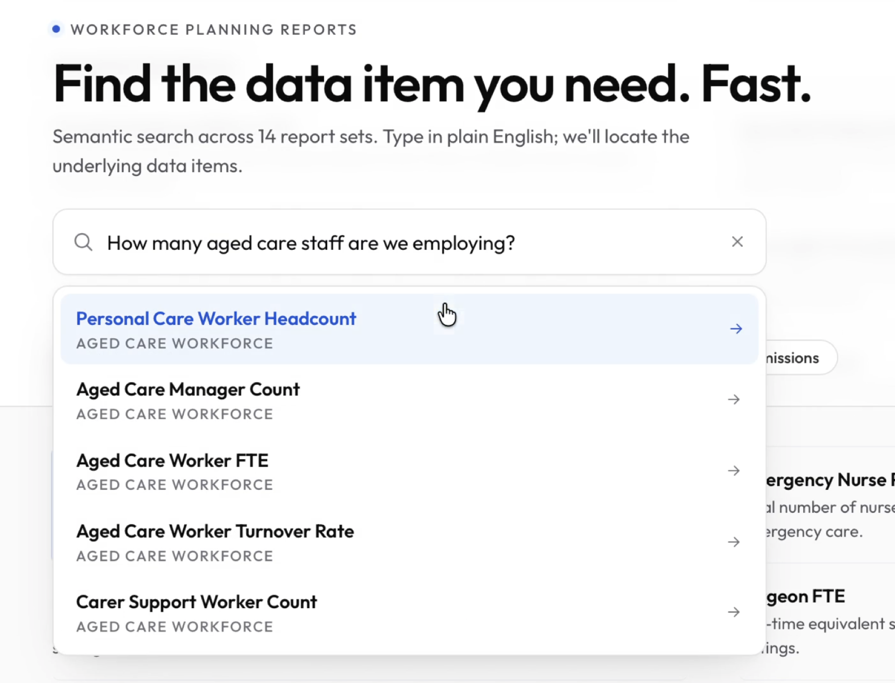

# Auto Search

Semantic search for structured data item catalogues. Type a natural-language query; jump straight to the matching item across any report set.

A fine-tuned `all-MiniLM-L6-v2` (INT8 ONNX, runs in-JVM) lifts Recall@1 from 0.80 to 0.85 over the best off-the-shelf baseline on a 350-item health workforce planning corpus — no vector DB, no per-query model cost, no GPU.



---

## Version history

| Version | Description |
|---|---|
| v0.2.0 | Tier-2 portability: backend serves corpus + UI config via REST; frontend bootstraps from `/api/v1/corpus` and `/api/v1/corpus/ui-config`; `autosearch ui-config` CLI derives UI labels via Claude. New domain = `corpus.json` + `config.yaml` + `autosearch pipeline` + backend restart. No frontend rebuild. Playwright E2E (`npm run test:e2e`) proves the swap across health-workforce and it-service-catalogue. |
| v0.1.0 | Initial release: fine-tuned `all-MiniLM-L6-v2` (INT8 ONNX) served in-JVM via Spring Boot + Vue 3 frontend. Offline pipeline (generate → train → export → embed) with delta-aware manifest. Recall@1 0.85 / MRR@5 0.91 on the 350-item health workforce planning corpus. |

---

## Problem

Users need to know which Report Set a measure or dimension lives under before they can find it. The current workflow is manual: navigate report sets, Ctrl-F for the name, fail if your search term differs from the data item name. The domain uses acronyms and specialist terminology that vary by user background (e.g. "GP FTE", "GP full time equivalent", "doctor hours").

---

## Solution

A semantic search bar. The user types a natural-language query; the app finds the best-matching data item across all report sets and navigates directly to it, scrolling and highlighting the result.

---

## Architecture

### Offline pipeline (runs once, then on corpus change)

```
corpus.json
  → generate_pairs.py      Claude API: 10 queries per item → ~3,500 pairs
  → train.py               sentence-transformers fine-tune (MultipleNegativesRankingLoss)
  → export_onnx.py         ONNX export + INT8 quantisation
  → precompute_embeddings.py  embed all items (delta-aware) → data-items.json
  → ui_config.py           Claude API: derive UI labels → corpus-ui.json
  → S3: autosearch-artefacts-{env}/
        model/autosearch-embed.onnx
        embeddings/data-items.json
        ui/corpus-ui.json
```

### Runtime (Java/Spring)

```
App startup:
  EmbeddingService  — loads autosearch-embed.onnx
  SimilarityService — loads data-items.json (in-memory vectors)
  CorpusController  — serves /api/v1/corpus and /api/v1/corpus/ui-config

Frontend bootstrap:
  main.js fetches /api/v1/corpus and /api/v1/corpus/ui-config → Vuex store
  Vue mounts with the corpus and UI labels for the configured domain

User search:
  SearchBar (300ms debounce, min 3 chars)
    → POST /api/v1/search { "query": "...", "topK": 5 }
    → Java: embed query via ONNX Runtime
    → cosine similarity against in-memory vectors
    → return top-5 [{ wppId, itemId, itemName, score }]
    → SearchResults dropdown
    → user selects → navigate with ?highlight={itemId}
    → DataItemHighlight: scroll, highlight (CSS fade, 3s)
```

### Delta strategy

A manifest (`manifest.json`) stores a content hash per item: `sha256(wpp_id + item_id + name + description)`. Each pipeline run diffs the corpus against the manifest and only regenerates pairs and embeddings for new or changed items.

---

## Quick Start

End-to-end run on any corpus. **Prerequisite:** `ANTHROPIC_API_KEY` environment variable.

```bash
# Set up Python venv (Python 3.11+)
python3 -m venv .venv && source .venv/bin/activate
pip install -e .
pip install -r fine-tuning/requirements.txt
pip install -r test-harness/requirements.txt

# 1. Bring your own corpus.json + config.yaml (see examples/)
#    Or use the bundled IT service catalogue example:
EX=examples/it-service-catalogue

# 2. Run the full pipeline (generate -> train -> export -> embed -> ui-config)
autosearch pipeline --corpus $EX/corpus.json --config $EX/config.yaml --local

# 3. Start the Java backend pointing at the generated artefacts
ARTS=output/it-service-catalogue
mvn -f backend/autosearch-spring/pom.xml spring-boot:run \
  -Dspring-boot.run.arguments="\
    --autosearch.config-path=$EX/config.yaml \
    --autosearch.model-path=$ARTS/artefacts/autosearch-embed.onnx \
    --autosearch.tokenizer-path=$ARTS/artefacts/ \
    --autosearch.embeddings-path=$ARTS/data-items.json \
    --autosearch.corpus-path=$EX/corpus.json \
    --autosearch.ui-config-path=$EX/corpus-ui.json"

# 4. Start the Vue frontend (separate terminal)
cd frontend && npm install && npm run dev
# Opens at http://localhost:5173 — no rebuild needed to switch corpora
```

**Switch domains:** stop the backend, point the `-D` properties at a different example's artefacts, restart. The frontend fetches the corpus and UI labels from the backend on load, so no frontend rebuild is required.

---

## Corpus format

`corpus.json` is the only input the pipeline needs:

```json
[
  {
    "item_id": 1,
    "wpp_id": 1,
    "name": "GP FTE",
    "description": "Full-time equivalent general practitioners delivering primary care services."
  }
]
```

| Field | Required | Notes |
|---|---|---|
| `item_id` | Yes | Integer. Unique. Stable — changing breaks manifest delta. |
| `wpp_id` | Yes | Integer. Stable parent report set identifier. |
| `name` | Yes | Display name. Used for embedding. |
| `description` | Recommended | Significantly improves recall. Empty string if unavailable. |

A reference corpus of ~350 synthetic items (health workforce planning concepts) ships in `test-harness/data/corpus.json`. To adapt to a different domain, replace it and re-run the pipeline — see [Using your own corpus](#using-your-own-corpus).

---

## Evaluation Results

Benchmarked on the 350-item seed corpus. Fine-tuning used 5,200 training pairs generated by Claude Haiku, with a 20% holdout.

| Model | Recall@1 | MRR@5 |
|---|---|---|
| all-MiniLM-L6-v2 (OOTB baseline) | 0.750 | 0.808 |
| bge-small-en-v1.5 (OOTB baseline) | 0.800 | 0.850 |
| all-MiniLM-L6-v2 (fine-tuned, INT8 ONNX) | **0.850** | **0.908** |

Fine-tuning delivers a **+10pp Recall@1** and **+6pp MRR@5** lift over the best OOTB baseline. Full scores in `test-harness/results/scores-2026-04-24.csv`.

---

## Key Decisions

| Decision | Rationale |
|---|---|
| Fine-tuned ONNX in JVM over Bedrock at runtime | Zero query latency, no per-query cost, self-contained |
| `all-MiniLM-L6-v2` as base model | 22M params, runs on CPU, strong sentence retrieval baseline, ONNX-exportable |
| Synthetic pairs via Claude API | No labeled data; LLM-generated query variations are a well-established substitute |
| Two synthetic test sets with different phrasing distributions | The LLM holdout measures memorisation; a smaller secondary set with shorter, keyword-style queries measures generalisation beyond the training pairs' verbose conversational style. Real-user query logs are a follow-up |
| Delta-aware pipeline | Avoids regenerating pairs for unchanged items |
| `corpus.json` provided externally | Decouples pipeline from source DB; any team can supply the file |
| No external vector DB | 350 items fits trivially in JVM memory; removes operational dependency |
| `--local` flag on all pipeline scripts | Full end-to-end proof with only `ANTHROPIC_API_KEY`; no AWS until production |
| `minScore = 0.3` confidence threshold | Suppresses low-confidence results rather than returning misleading matches |

---

## Using your own corpus

1. Copy `config.yaml` to your repo root and update `corpus.id_field`, `corpus.group_field`, `corpus.name_field`, `corpus.description_field` to match your JSON keys. Set `name` and `pipeline.domain_description`.
2. Supply your `corpus.json` (an array of objects with at least the four configured fields).
3. Run `autosearch pipeline --corpus your-corpus.json --config your-config.yaml --local`. The pipeline is delta-aware — only new or changed items get re-embedded. The final step generates `corpus-ui.json` (UI title, lede, suggestions, group names) via Claude.
4. Start the backend pointing `--autosearch.corpus-path` and `--autosearch.ui-config-path` at your generated files (see Quick Start).
5. Optionally hand-edit `corpus-ui.json` to add `searchAriaLabel` or tune any LLM-generated label.
6. Optionally supply domain-specific `test-queries.json` and run `autosearch evaluate` to benchmark model quality.

See `examples/it-service-catalogue/` and `examples/health-workforce/` for worked examples.

Note: `searchAriaLabel` is optional and not derived automatically by `ui-config` — supply it manually in `corpus-ui.json` if you want a custom value (default: "Search").

---

## License

MIT
