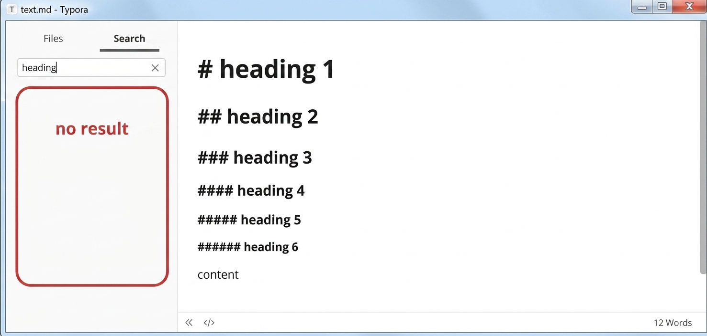
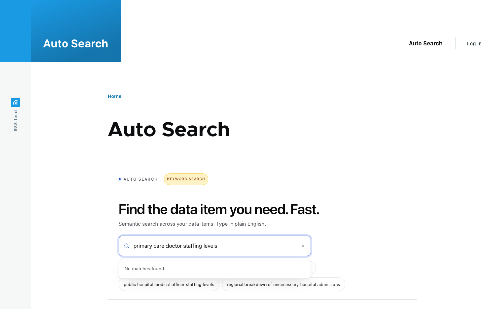
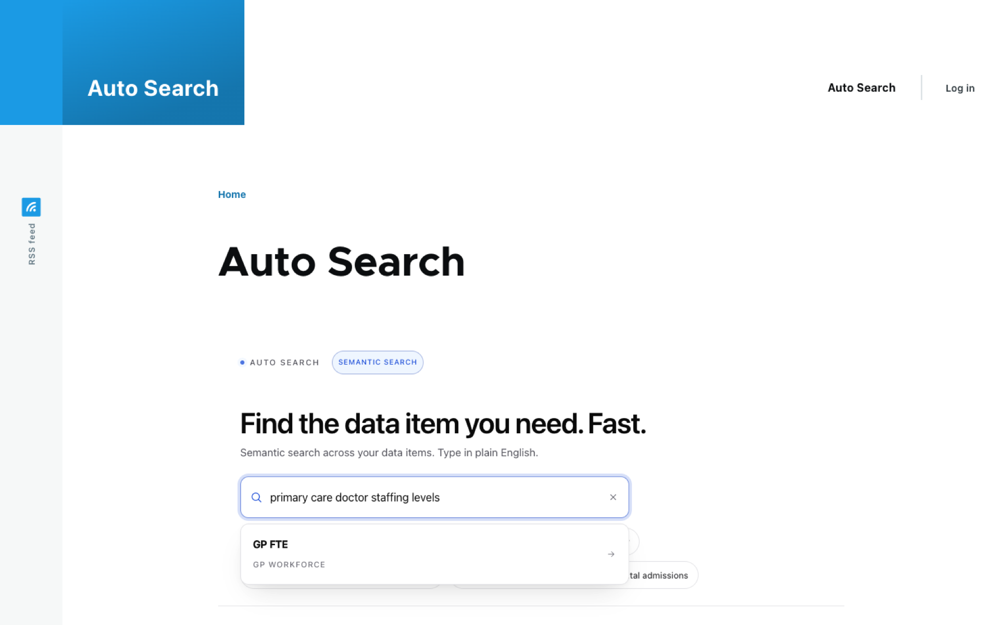

<style>
@import url('https://fonts.googleapis.com/css2?family=Inter:wght@300;400;500;600&family=JetBrains+Mono:wght@400&display=swap');

:root {
  --color-background: #ffffff;
  --color-foreground: #1c1c1c;
  --color-heading: #111111;
  --color-muted: #888888;
  --color-rule: #e8e8e8;
  --color-accent: #0066cc;
  --font-default: 'Inter', 'Segoe UI', system-ui, sans-serif;
  --font-mono: 'JetBrains Mono', 'Consolas', monospace;
}

section {
  background-color: var(--color-background);
  color: var(--color-foreground);
  font-family: var(--font-default);
  font-weight: 300;
  box-sizing: border-box;
  padding: 64px 80px 56px;
  font-size: 22px;
  line-height: 1.75;
}

section::after {
  font-size: 13px;
  color: var(--color-muted);
  font-family: var(--font-default);
  font-weight: 300;
}

h1, h2, h3 {
  font-family: var(--font-default);
  margin: 0;
  padding: 0;
  color: var(--color-heading);
}

h1 {
  font-size: 54px;
  font-weight: 300;
  line-height: 1.2;
  letter-spacing: -0.02em;
}

h2 {
  font-size: 36px;
  font-weight: 400;
  letter-spacing: -0.01em;
  margin-bottom: 32px;
  padding-bottom: 16px;
  border-bottom: 1px solid var(--color-rule);
}

h3 {
  font-size: 21px;
  font-weight: 500;
  color: var(--color-accent);
  margin-top: 28px;
  margin-bottom: 8px;
}

ul, ol {
  padding-left: 24px;
  margin: 0;
}

li {
  margin-bottom: 10px;
  color: var(--color-foreground);
}

li strong {
  font-weight: 500;
  color: var(--color-heading);
}

p {
  margin: 0 0 14px;
}

code {
  font-family: var(--font-mono);
  font-size: 0.85em;
  background-color: #f4f4f4;
  color: #333;
  padding: 2px 7px;
  border-radius: 3px;
}

pre {
  background-color: #f6f8fa;
  border: 1px solid var(--color-rule);
  border-radius: 4px;
  padding: 16px;
  font-family: var(--font-mono);
  font-size: 24px;
  line-height: 1.5;
}

pre code {
  background: none;
  padding: 0;
  border-radius: 0;
}

table {
  width: 100%;
  border-collapse: collapse;
  font-size: 0.88em;
  font-weight: 300;
  margin-top: 8px;
}

th {
  font-weight: 500;
  font-size: 0.85em;
  color: var(--color-muted);
  text-transform: uppercase;
  letter-spacing: 0.05em;
  padding: 8px 14px;
  border-bottom: 1px solid var(--color-rule);
  text-align: left;
}

td {
  padding: 10px 14px;
  border-bottom: 1px solid var(--color-rule);
  vertical-align: top;
}

/* Title / lead slide */
section.lead {
  display: flex;
  flex-direction: column;
  justify-content: center;
  padding: 80px;
  border-left: 3px solid var(--color-heading);
}

section.lead h1 {
  font-size: 58px;
  font-weight: 300;
  letter-spacing: -0.03em;
  margin-bottom: 24px;
  line-height: 1.15;
}

section.lead p {
  font-size: 20px;
  color: var(--color-muted);
  font-weight: 300;
  margin: 0;
  line-height: 1.6;
}

/* Section break slides */
section.break {
  display: flex;
  flex-direction: column;
  justify-content: center;
  padding: 80px;
  background-color: var(--color-heading);
  color: #ffffff;
}

section.break h1 {
  font-size: 48px;
  font-weight: 300;
  color: #ffffff;
  letter-spacing: -0.02em;
  margin-bottom: 16px;
}

section.break p {
  font-size: 20px;
  color: rgba(255,255,255,0.55);
  margin: 0;
}

/* Appendix */
section.appendix h2 {
  color: var(--color-muted);
  font-size: 28px;
  border-bottom-color: #eeeeee;
}

/* Inline note / callout */
.note {
  border-left: 2px solid var(--color-rule);
  padding-left: 20px;
  color: var(--color-muted);
  font-size: 0.9em;
  margin-top: 20px;
}

/* Definition callout */
.def {
  border-left: 2px solid var(--color-accent);
  padding-left: 14px;
  font-size: 0.82em;
  color: var(--color-muted);
  margin-top: 12px;
}

.def strong {
  color: var(--color-foreground);
}
</style>

<!-- _class: lead -->
<!-- _paginate: false -->

# Semantic Search inside Drupal

<br/>
Running a fine-tuned model in a Drupal module. No sidecar, APIs or new software.

Ching Chew · September 2026

<br/>


<!-- note:
"Hi everyone! Thank you for the opportunity to speak with you about a topic that I am passionate about: to help users find what they are looking for. The ability to understand the user's meaning, context and intent behind a search, not just the keywords used, is semantic search."

"Cloud hosting and APIs make semantic search easy to run and consume. You can also install various software and tools if you host inhouse. What if you don't want to introduce another dependency and want to run this inside Drupal? This is where this presentation comes in."

"Before we start, the QR code is to the GitHub repo. Link also on the last slide. Just a note on code: it is in the `drupal` branch, and builds on the Vue on Drupal talk that I did last year so if you are wanting to unpack that further, I have a blog post and GitHub repo for it."
-->

---



<!-- note:
"Hands up if anyone here experienced frustration with search: especially trying to find something you are sure exists in the system?"

"No imagine this frustration in your user base, using your website or application."
-->

---

## The Naming Problem

A user wants to find "how many GPs we have."

- The data item is called "GP FTE"
- Or "Total practitioner FTE"
- Or something else again, depends who wrote it

<br/>

**Search matches names. Users might know it as something else.**

<!-- note:
"I see search failures (outside of technical or code problems) when there is a mental model mismatch between the user and the developer of the search tool."

Trousers vs pants.
-->

---




<!-- note:
"Same query. Same Drupal module. Different search."
-->

---

## The Search Ladder



Each rung buys recall. None solve vocabulary mismatch.

<!-- note:
"The first step is like a SQL 'LIKE' query where you are matching on the search phrase. If you have a typo or use different terms, you won't get a result."

"The second step is where you do some NL processing: tokenise to 3-4 characters, stem to base word etc to hopefully return some more results to users."

Rung 3 (Solr/OpenSearch + synonyms): you might source synonyms from your site analytics or logs, to address search terms that don't return the results you want users to see. The synonym list is a bag of intent someone has to maintain forever.

Rung 4 is OOTB embeddings (aka vectors, machine representation of meaning, series of numbers, longer numbers or more dimensions mean more naunce), we will demo fine-tuned (improved) version of Rung 4. I will explain how fine-tuning works later.

Swap to browser tab with embedding diagram.

Definition callout if the room needs it: "Solr" / "OpenSearch": a dedicated search engine service some Drupal sites index content into, separate from the database.
-->

---

## The Drupal Ecosystem's Answer Today

That's the general shape of the problem and the fix. Here's where Drupal sits today:

- **AI Search + Ollama**: a sidecar service, 5 to 15 GB RAM
- **AI Search / Semantic Search + OpenAI**: external API call per query, a key to manage, per-query cost
- **Search API Embeddings**: in-process, but Word2Vec, 2013-era tech
- **Scolta** (new, Aug 2026): client-side lexical index + LLM query rewriting, not embeddings

<br/>

**Every option is a sidecar, an API call, or not a modern embedding model.**

<!-- note:
Scan slide. Move at pace.

Ollama is like Docker for language models. Install on laptop or server and you can try different language models, including embedding models.

Scolta: lexical index in the browser, not vector embeddings.
-->

---

## The Actual Gap

Nobody in the Drupal ecosystem runs a modern transformer embedding model inside the PHP process.

- An INT8-quantised, fine-tuned `all-MiniLM-L6-v2` is ~22 MB
- That is small enough to load once, in-process, on first request
- No Ollama. No external call. No vector database.

<br/>

**This is what that looks like.**

<!-- note:
"Quantisation is process of reducing the precision of weights and activation functions in a neural network to reduce the size of language models."

"no new service to procure, no new SLA to negotiate."

22 MB is smaller than most people's mental model of "a machine learning model."
-->

---

<!-- _class: break -->
<!-- _paginate: false -->

# Live Demo

Keyword vs Semantic, Running Inside Drupal

<!-- note:
1. Confirm Drupal is up: curl localhost:8080/api/v1/search/health
2. Keyword mode (?mode=keyword): type "primary care doctor staffing levels" => "No matches found"
3. Switch to semantic mode, same query => "GP FTE" surfaces, single best match
4. Click through => navigates to the report, scrolls, fades highlight
5. Optional: show /admin/modules with Auto Search enabled: "this is a real module, not a bolt-on"

Platform adaptation: if the venue wifi is unreliable, this entire demo is local Docker, no internet dependency. Say so up front; it's a feature of the architecture, not a caveat.

Backup: if Docker fails to start, the before/after screenshots already shown cover this exact sequence, narrate from memory if needed.
-->

---

## The Vocabulary Problem



Off-the-shelf embeddings know "doctor" is close to "physician".

They do not know "GP FTE" means "general practitioner full-time equivalent" in an Australian primary care context.

**That is what fine-tuning fixes.**

<!-- note:
"If vocabulary mismatch is the cause of bad search experience, fine-tuning teaches the model your custom vocabulary. Again, this is especially important when you have specialised domain or a range of user types."
-->

---

## The Training Pipeline


Usually you have human-labelled data. I didn't, so I got Claude to write ~10 query/item pairs for each of 350 items, ~5,900 total after re-runs. ~30c on Haiku.

<!-- note:
"This demo started with a Java backend. The training side didn't change at all when this got ported to PHP, only the runtime did. You can run ONNX models on different programming languages."

Walk the boxes left to right at pace:
- generate_pairs.py: one Claude call per item, 10 natural-language queries each ("how many FTE GPs do we have" against the item "GP FTE").
- train.py: sentence-transformers fine-tune. Loss for anyone technical: MultipleNegativesRankingLoss, every other item in the batch is an implicit negative. Batch 32, three epochs.
- export_onnx.py: ONNX export + INT8 quantise, this is where the 22 MB file comes from.
- precompute_embeddings.py: embed every corpus item once. Delta-aware via a content-hash manifest, only new or changed items get re-done.
- Output ships as a GitHub release; setup-model.sh fetches it on a fresh clone.

Non-technical framing: "we used one big AI model to generate the training examples for a different, much smaller AI model." Don't dwell on the loss function name.
-->

---

## Eval Results

| Model | Size | Recall@1 | MRR@5 |
|---|---|---|---|
| all-MiniLM-L6-v2 (OOTB) | 91 MB | 0.750 | 0.808 |
| bge-small-en-v1.5 (OOTB, larger) | 133 MB | 0.800 | 0.850 |
| **all-MiniLM-L6-v2 fine-tuned (INT8 ONNX)** | **22 MB** | **0.850** | **0.908** |

**More accurate than the larger model.**

<div class="def"><strong>Recall@1</strong>: how often the correct item is the very top result. 0.85 means 85 times out of 100.</div>
<div class="def"><strong>MRR@5</strong>: Mean Reciprocal Rank across the top 5 results. Rewards a correct answer even if it isn't first: rank 2 scores 0.5, rank 3 scores 0.33.</div>

<div class="note">Headline column is the n=20 keyword-style set; the n=1182 LLM holdout shows the same ordering.</div>

<!-- note:
Same model, same numbers as the JVM version, nothing about the Drupal port changes accuracy, only where it runs. Fine-tuned model performs between than larger model, which is expected since it is more specialised to the domain.

--- 

Two test sets, both synthetic. LLM holdout (0.93) vs a smaller secondary set (0.85) with shorter, keyword-style queries. The gap is what the model learned about Claude's verbose phrasing vs terser phrasings. Logged queries from a live deployment would be the strongest signal but don't exist yet.

Size numbers: OOTB fp32 checkpoints as downloaded from Hugging Face (91 MB, 133 MB). The 22 MB figure is the fine-tuned model after INT8 quantisation, the actual file running in the demo. Not a like-for-like quantisation comparison, but an honest one: this is what ships vs what you'd get OOTB.

n=20 on the secondary set, directional only, not statistically significant on its own. The larger LLM holdout (n=1182) shows the same ranking.
-->

---

## Architecture



No new frontend logic apart from three small Drupal compatibility tweaks. Everything new is in the PHP module.

<div class="def"><strong>ONNX</strong>: Open Neural Network Exchange. A portable model format; the same file runs in Java, Python or PHP.</div>
<div class="def"><strong>FFI</strong>: Foreign Function Interface. Lets PHP call native C++ code directly, no network involved.</div>

<!-- note:
[deep] slide.

"So how does the fine-tuned model fit into the solution?""

"The Vue SPA is served as a Drupal library, the same pattern as an earlier Vue.js-in-Drupal talk to this group."

"The UI calls an API exposed by the custom Drupal module. It runs a tokeniser to pre-process the input, generate an embedding for the search input then finds the most similar results."
-->

---

## Code Walk

```php
public function search(Request $request): JsonResponse {
  $body  = json_decode($request->getContent(), TRUE);
  $query = trim((string) ($body['query'] ?? ''));
  $topK  = max(1, min(20, (int) ($body['topK'] ?? 5)));

  $vec     = $this->embedding->embed($query);        // ONNX inference, in-process
  $results = $this->similarity->search($vec, $topK); // cosine vs in-memory vectors

  return new JsonResponse($results);
}
```

The whole search path: embed the query, score it against vectors already in memory, return the top matches. The hard part was upstream: PHP has no HuggingFace Tokenizers equivalent, so the WordPiece tokenizer feeding `embed()` is a hand port, validated token-for-token against the Java and Python versions.

<!-- note:
[deep] slide.

"2 main things: we embed the query then calculate similarity to candidates. You can make it more fancy: sanitise search terms, sanitise results etc."

---
The hand-ported tokenizer was the highest-risk piece of the whole port. Detail if asked: no HuggingFace Tokenizers equivalent in PHP, so normalize -> pre-tokenize -> WordPiece -> CLS/SEP was rewritten by hand and checked token-for-token against the Java and Python implementations before trusting it near the model.

Peer question likely to come up: "why not call out to a Python sidecar for tokenization?" Answer: that reintroduces exactly the sidecar dependency the whole talk argues against. Model in-process means tokenizer in-process too.

EmbeddingService::embed() itself: FFI call into ankane/onnxruntime-php, then mean-pool and L2-normalise, identical logic to the Java version. Show it only if there's time and appetite.
-->

---

## Two Deployment Modes

If you are deploying this to Production:

| | Self-hosted / GovCMS PaaS | GovCMS SaaS |
|---|---|---|
| Custom modules at all | Yes, agency controls the container | Not permitted, approved module set only |
| `libonnxruntime.so` | Install it, same as self-hosted | Moot, custom code isn't an option here |

<!-- note:
"Probably no surprise to this audience: can only do this on self-hosted or PaaS."

---
SaaS and PaaS are genuinely different services, not two flavours of the same constraint. SaaS is fully managed with a fixed approved module and theme set, no custom code, full stop, regardless of what that code does. PaaS runs on Lagoon/Kubernetes and the agency owns its own Docker image, exactly the same model as tonight's local demo, so libonnxruntime.so is exactly as available there as it is self-hosted.

Exec framing: the answer to "can my team actually run this" is "yes, if you're on PaaS or self-hosted; no, if you're on SaaS, and that's true of any custom module, not just this one."
-->

---

## Clone and Run Tonight

```bash
git clone -b drupal https://github.com/cchew/auto-search
cd auto-search/drupal
bash setup-model.sh health-workforce
docker compose up --build
```

Then open `localhost:8080/autosearch`.

<!-- note:
Say the URL out loud.

"It comes with 2 pre-built domains: health workforce data and IT service catalog. You can swap it: setup-model.sh takes any corpus name matching a folder under examples/"

"You can also use your own domain: human label `corpus.json` or ask your favourite LLM to generate."
-->

---

## Conclusion

"The user does not care what you use for search. They care that the search worked."

<br/>

- Most search problems are vocabulary problems
- Fine-tuned small models beat off-the-shelf larger models on domain tasks
- The infrastructure can stay boring

<br/>

Thank you

Questions: DM via LinkedIn
Code: github.com/cchew/auto-search (drupal branch), clone it and run it tonight

<!-- note:
"Congratulations on surviving quite an intense presentation: embedding models, technical terms like ONNIX/FFI, ML concepts like fine tuning/recall. Hope you take away some ideas of how to solve the vocabulary mismatch search problem, without the need to introduce a new dependency or installing new server software."

"Thank you again for the opportunity and being an amazing audience."

Open Q&A. Likely questions:
- "Does this work on Drupal 11?" Yes, info.yml declares ^10 || ^11
- "What about content types beyond a flat corpus?" Corpus.json is the interface; anything that flattens to items with a name/description works today, entity-aware indexing will need more work
- "Why not just use Scolta?" Different problem: Scolta rewrites queries against a lexical index; this does real semantic similarity. Use Scolta if you want zero infra and can live with lexical search; use this if you need the model to actually understand domain vocabulary.
- Cost? ~30c training on Haiku, $0 per query.
-->

---

<!-- _class: appendix -->
<!-- _paginate: false -->

## Appendix A: Production Considerations

**Not yet built**
- Config schema (`config/schema/autosearch.schema.yml`): required before any settings form
- Scoped permission on the search endpoint: all routes currently `_access: 'TRUE'` for the demo
- Uninstall hook: cleans up generated proxy classes and cached embeddings
- CSRF protection on `POST /api/v1/search`: fine for anonymous read-only demo, not for writes

**Ops surface**
- One Drupal module. Model loads lazily on first search request, not every page load
- No external service calls in the search path (self-hosted mode)
- Memory: ~22 MB model + (N items × 384 × 4 bytes) vectors, same envelope as the JVM version

<!-- note:
Cover only if asked. This is the "what would you still need to do before production" list, a peer audience will ask, an exec audience usually won't.
-->

---

<!-- _class: appendix -->
<!-- _paginate: false -->

## Appendix B: Tech Stack

**Drupal module (PHP)**
- PHP 8.3, Drupal 10/11
- `ankane/onnxruntime-php` (FFI binding to ONNX Runtime 1.26.0)
- Hand-ported WordPiece tokenizer (no external dependency)

**Unchanged from the JVM version**
- Model: fine-tuned `all-MiniLM-L6-v2`, INT8, ONNX export
- Training pipeline: Python, sentence-transformers, Claude-generated synthetic pairs
- Frontend: Vue 3, served as a Drupal library

**Infra**
- Docker Compose: Drupal 10 + MariaDB 10.11 (`--skip-ssl`)
- Olivero (front theme) + Claro (admin theme)

<!-- note:
Tech stack on request. The point to land if asked: nothing about the model or training pipeline changed for this port, only the runtime host.
-->

---

<!-- _class: appendix -->
<!-- _paginate: false -->

## Appendix C: Lessons Learnt

- **FFI and `intl` extensions aren't compiled in by default**: bites on managed PHP images without root access to the build
- **Lazy service proxies break constructor type hints**: Drupal's generated proxies don't extend the concrete class; type the constructor as `object`
- **MariaDB 10.11 requires SSL by default**: `mysqladmin` and `pdo_mysql` both fail until `--skip-ssl` is set explicitly

<!-- note:
Cover only if asked, or if there's time to spare, these are the three that would waste someone a full afternoon if they hit them cold.

Peer audience: this is the "here's what I tried first and didn't work" content this profile responds to. Worth surfacing proactively for a technical Q&A even if not asked directly.
-->
