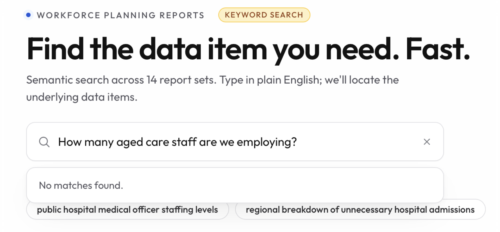
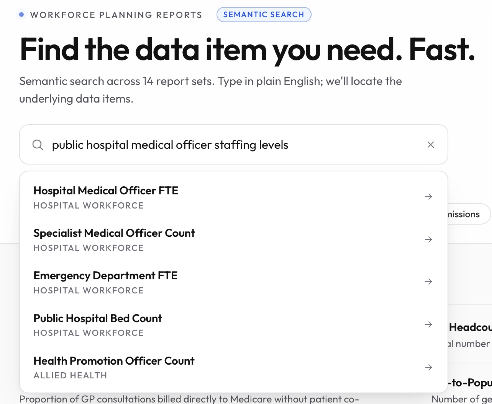

<style>
@import url('https://fonts.googleapis.com/css2?family=Inter:wght@300;400;500;600&family=JetBrains+Mono:wght@400&display=swap');

:root {
  --color-background: #ffffff;
  --color-foreground: #1c1c1c;
  --color-heading: #111111;
  --color-muted: #888888;
  --color-rule: #e8e8e8;
  --color-accent: #0066cc;
  --font-default: 'Inter', 'Segoe UI', system-ui, sans-serif;
  --font-mono: 'JetBrains Mono', 'Consolas', monospace;
}

section {
  background-color: var(--color-background);
  color: var(--color-foreground);
  font-family: var(--font-default);
  font-weight: 300;
  box-sizing: border-box;
  padding: 64px 80px 56px;
  font-size: 22px;
  line-height: 1.75;
}

section::after {
  font-size: 13px;
  color: var(--color-muted);
  font-family: var(--font-default);
  font-weight: 300;
}

h1, h2, h3 {
  font-family: var(--font-default);
  margin: 0;
  padding: 0;
  color: var(--color-heading);
}

h1 {
  font-size: 54px;
  font-weight: 300;
  line-height: 1.2;
  letter-spacing: -0.02em;
}

h2 {
  font-size: 36px;
  font-weight: 400;
  letter-spacing: -0.01em;
  margin-bottom: 32px;
  padding-bottom: 16px;
  border-bottom: 1px solid var(--color-rule);
}

h3 {
  font-size: 21px;
  font-weight: 500;
  color: var(--color-accent);
  margin-top: 28px;
  margin-bottom: 8px;
}

ul, ol {
  padding-left: 24px;
  margin: 0;
}

li {
  margin-bottom: 10px;
  color: var(--color-foreground);
}

li strong {
  font-weight: 500;
  color: var(--color-heading);
}

p {
  margin: 0 0 14px;
}

code {
  font-family: var(--font-mono);
  font-size: 0.85em;
  background-color: #f4f4f4;
  color: #333;
  padding: 2px 7px;
  border-radius: 3px;
}

pre {
  background-color: #f6f8fa;
  border: 1px solid var(--color-rule);
  border-radius: 4px;
  padding: 16px;
  font-family: var(--font-mono);
  font-size: 24px;
  line-height: 1.5;
}

pre code {
  background: none;
  padding: 0;
  border-radius: 0;
}

table {
  width: 100%;
  border-collapse: collapse;
  font-size: 0.88em;
  font-weight: 300;
  margin-top: 8px;
}

th {
  font-weight: 500;
  font-size: 0.85em;
  color: var(--color-muted);
  text-transform: uppercase;
  letter-spacing: 0.05em;
  padding: 8px 14px;
  border-bottom: 1px solid var(--color-rule);
  text-align: left;
}

td {
  padding: 10px 14px;
  border-bottom: 1px solid var(--color-rule);
  vertical-align: top;
}

/* Title / lead slide */
section.lead {
  display: flex;
  flex-direction: column;
  justify-content: center;
  padding: 80px;
  border-left: 3px solid var(--color-heading);
}

section.lead h1 {
  font-size: 58px;
  font-weight: 300;
  letter-spacing: -0.03em;
  margin-bottom: 24px;
  line-height: 1.15;
}

section.lead p {
  font-size: 20px;
  color: var(--color-muted);
  font-weight: 300;
  margin: 0;
  line-height: 1.6;
}

/* Section break slides */
section.break {
  display: flex;
  flex-direction: column;
  justify-content: center;
  padding: 80px;
  background-color: var(--color-heading);
  color: #ffffff;
}

section.break h1 {
  font-size: 48px;
  font-weight: 300;
  color: #ffffff;
  letter-spacing: -0.02em;
  margin-bottom: 16px;
}

section.break p {
  font-size: 20px;
  color: rgba(255,255,255,0.55);
  margin: 0;
}

/* Appendix */
section.appendix h2 {
  color: var(--color-muted);
  font-size: 28px;
  border-bottom-color: #eeeeee;
}

/* Inline note / callout */
.note {
  border-left: 2px solid var(--color-rule);
  padding-left: 20px;
  color: var(--color-muted);
  font-size: 0.9em;
  margin-top: 20px;
}
</style>

<!-- _class: lead -->
<!-- _paginate: false -->

# Search by Intent, Not by Name

<br/>
Semantic search inside a Java app.

Ching Chew · May 2026

<br/>


<!-- note:
Pre-show: WPP open with stock keyword search visible. Auto Search tab ready in second window. Backend running locally.

Ask: when you can't remember the exact name of the thing you're looking for in a tool you use every day, what do you do?
=> Ctrl-F a few guesses. Then go ask the person who built it.

Today we'll look at the rung of the search ladder above OpenSearch. Why it works. Why fine-tuning matters. And why it can run inside the JVM you already have.
-->

---

## The Naming Problem

A report user wants to find "how many GPs we have."

- The data item is called "GP FTE"
- Or "Total practitioner FTE"
- Or something else again — depends who wrote it
<br/>

**Search matches names. Users remember concepts.**

<!-- note:
Universal in line-of-business apps with specialist vocabulary.
Don't answer the rhetorical. Let the room think of their own version.

This is the same problem in your CRM, your asset register, your analytics dashboard.
-->

---




<!-- note:
Full-bleed split. No narration.
"Same query. Same dataset. Different search."
-->

---

## The Search Ladder



Each rung buys recall. None solve vocabulary mismatch.

<!-- note:
Walk the ladder briefly. Most teams sit at rung 2 or 3.

Rung 3 (OpenSearch + synonyms): the synonym list is a bag of intent the team has to maintain forever. Every new acronym is a config change.

Rung 4 is what we're about to demo.
-->

---

<!-- _class: break -->
<!-- _paginate: false -->

# Live Demo

Keyword vs Semantic

<!-- note:
1. Open WPP. Type "doctor hours" into stock search => nothing useful
2. Same query in Auto Search dropdown => GP FTE, top result, 0.87 confidence
3. Click => navigates to report set, scrolls, fades highlight
4. Try "GP FTE" => same item
5. Try "general practitioner full time equivalent" => same item

Three phrasings. Zero shared tokens. Same answer. That's the point.
-->

---

## The Vocabulary Problem



Off-the-shelf embeddings know "doctor" ≈ "physician".

They do not know "GP FTE" = "general practitioner full-time equivalent" in Australian primary care.

**That is what fine-tuning fixes.**

<!-- note:
Domain vocabulary is the reason for everything that follows.

OOTB MiniLM: Recall@1 = 0.75
OOTB bge-small (larger): Recall@1 = 0.80
Both miss one query in five. Misses cluster on domain phrasings — exactly the queries that matter most.

Fine-tuning teaches it the domain vocabulary.
-->

---

## Synthetic Pairs from Claude

No human labelled "golden dataset" so we generate them from an LLM.

```python
prompt = (
  f"Data item:\nName: {item['name']}\n"
  f"Description: {item.get('description', '')}\n\n"
  f"Generate 10 diverse natural-language queries a health "
  f"workforce planner might type to find this item. Include "
  f"acronym expansions, synonyms, colloquial phrasings."
)
```

~5,900 pairs across 350 items (re-runs accumulate). ~30c on Haiku.

<!-- note:
The unglamorous bit that made it work.

Loss function: MultipleNegativesRankingLoss — every other item in the batch acts as an implicit negative for any given query. Batch size 32, three epochs.

The catch: it teaches the model to recognise Claude's phrasing patterns. Real human query logs are a follow-up once the feature is live.
-->

---

## Architecture



C4 component view. ONNX model and vectors load once on app startup.

<!-- note:
For the room: this is a single Spring Boot JAR. Not a microservice. Not a vector DB.

Offline pipeline runs separately — Python, sentence-transformers, exports ONNX, precomputes embeddings, drops them in S3. App pulls them on startup.

Server-side embed + similarity: ~5ms on a laptop (excludes Vue debounce, network, DOM render).
-->

---

## Why ONNX in the JVM, not Bedrock

We can use something like Bedrock directly, but:

| | Bedrock per query | ONNX in JVM |
|---|---|---|
| Per-query call (typical) | ~50 ms | ~5 ms |
| Per-query cost | Yes | No |
| Network dependency | Yes | None after startup |
| Deployment surface | +1 service | Same JAR |

<span style="font-size:0.8em;color:#666">Bedrock = API round-trip; ONNX = in-process inference. The gap is the network, which is the point.</span>

<!-- note:
Bedrock is the obvious naive option. It works. It's also one network hop and a per-query bill on every keystroke after the debounce.

Fine-tuned MiniLM is 22M params. INT8 quantised ONNX is under 25 MB. Loads in <1s on a t3.medium.
-->

---

## Code Walk

```java
public float[] embed(String text) throws OrtException {
  Encoding enc = tokenizer.encode(text, true, true);
  try (
    OnnxTensor idsTensor  = OnnxTensor.createTensor(env, new long[][]{enc.getIds()});
    OnnxTensor maskTensor = OnnxTensor.createTensor(env, new long[][]{enc.getAttentionMask()});
    OrtSession.Result result = session.run(Map.of(
      "input_ids", idsTensor, "attention_mask", maskTensor, ...))
  ) {
    float[][][] hidden = (float[][][]) result.get("last_hidden_state").get().getValue();
    return meanPoolAndNormalize(hidden[0], enc.getAttentionMask());
  }
}

static float cosine(float[] a, float[] b) {
  float dot = 0;
  for (int i = 0; i < a.length; i++) dot += a[i] * b[i];
  return dot;
}
```

<!-- note:
EmbeddingService.embed: tokenize, run ONNX, mean-pool with mask, L2-normalise.

Cosine over normalised vectors is a dot product. For-loop over 350 vectors. No vector DB.

Day the corpus crosses ~50k items, this stops fitting a request budget. That's when HNSW or FAISS becomes worth the operational cost. Not before.
-->

---

## Eval Results

| Model | Recall@1 | MRR@5 |
|---|---|---|
| all-MiniLM-L6-v2 (OOTB) | 0.750 | 0.808 |
| bge-small-en-v1.5 (OOTB, larger) | 0.800 | 0.850 |
| **all-MiniLM-L6-v2 fine-tuned (INT8 ONNX)** | **0.850** | **0.908** |

Roughly +5pp Recall@1 over the best OOTB baseline (+10pp over the same MiniLM base). 
Smaller, faster, more accurate — directional only, n=20.

<!-- note:
Two test sets, both synthetic. LLM holdout (0.93) vs a smaller secondary set (0.85) with shorter, keyword-style queries. The gap is what the model learned about Claude's verbose phrasing vs terser phrasings. Logged queries from a live deployment would be the strongest signal but don't exist yet.

Fine-tuned beats the larger OOTB baseline. Domain knowledge > model size at this scale.

Recall@1 = 0.85 means 1 in 7 queries miss the top hit. Top-5 dropdown surfaces near-misses in slot 2 or 3.
-->

---

## Lessons Learnt

- **Threshold tuning matters more than the model** — `minScore = 0.4` set by eyeballing results
- **LLM holdout overstates performance** — weaker secondary set results; real-user logs are still a follow-up
- **Batch size affects retrieval training** — `MultipleNegativesRankingLoss` needs ≥32 to converge cleanly
- **Embeddings are not free RAM** — 50k items = 75 MB before indexing

<!-- note:
Honest about where the seams are.

Threshold revisits any time the model or corpus shifts. There's no clever way around this — eyeball the score distribution.

The gap between the two synthetic sets is the most important number to track. If it widens, the LLM holdout is over-fitted to Claude's style.
-->

---

## Where It Goes Next

- **Scale** — HNSW or FAISS when corpus crosses ~50k items
- **Generality** — `corpus.json` is the only input; any structured catalogue plugs in
- **Hybrid retrieval** — BM25 + semantic with score fusion for codes/IDs
- **Online learning** — logged queries with clicks become real labelled data

<br/>

The pattern: **fine-tune small, run in-process, evaluate honestly.**

<!-- note:
The bigger pattern is the takeaway.

You don't need a vector DB to ship semantic search. You don't need Bedrock per query. You don't need a GPU. You need a corpus, a few thousand synthetic pairs, three epochs of training, and an ONNX runtime in your JVM.

For most line-of-business search problems, that is enough.
-->

---

## Conclusion

"The user does not care which rung of the ladder you used. They care that the search worked."

<br/>

- Most search problems are vocabulary problems
- Fine-tuned small models beat off-the-shelf large models on domain tasks
- The infrastructure can stay boring

<br/>

- Thank you
- Feedback and questions: DM via Teams or LinkedIn
- Code: github.com/cchew/auto-search

<!-- note:
Land the takeaway: search is a UX problem dressed up as an ML problem. Solve the vocabulary mismatch and the rest is a for-loop.

Open Q&A. Likely questions:
- Why not RAG? (different problem — retrieval is one part of RAG; this is just retrieval)
- Cost? (~30c training on Haiku, $0 per query)
- Above OFFICIAL data? (self-hosted model, same code, no external API calls at runtime)
-->

---

<!-- _class: appendix -->
<!-- _paginate: false -->

## Appendix A — Production Considerations

**Model lifecycle**
- Version-pin the ONNX file; ship it with the deployment artifact
- Re-fine-tune when test set accuracy drops below an acceptable level
- Manifest-driven incremental embeddings — only changed items re-embed

**Ops surface**
- One JAR. Model + vectors load on startup (<1s for 350 items)
- No external service calls in the search path
- Memory: ~25 MB model + (N items × 384 × 4 bytes) vectors

**Above OFFICIAL data**
- Same code, self-hosted training (no Claude API for synthetic pairs)
- Or manually author pairs against a smaller seed corpus

<!-- note:
Cover only if asked. The governance story is short because the runtime has no external dependencies.
-->

---

<!-- _class: appendix -->
<!-- _paginate: false -->

## Appendix B — Tech Stack

**Training (Python)**
- sentence-transformers (fine-tune)
- Optimum (ONNX export + INT8 quantisation)
- Anthropic SDK (synthetic pair generation)

**Runtime (Java)**
- Spring Boot 3
- ONNX Runtime Java
- DJL HuggingFace Tokenizers
- Jackson for vector serialisation

**Frontend**
- Vue 3, Vuetify 3, Vue Router

<!-- note:
Tech stack on request. The Java side is intentionally boring — no Spring AI, no LangChain4j. ONNX Runtime + a tokenizer is the whole ML surface.
-->
